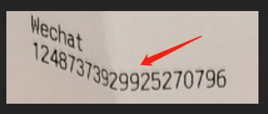

# tr - Text Recognition 

一款针对扫描文档的离线文本识别SDK，核心代码全部采用C++开发，并提供Python接口

编译环境: *Ubuntu 16.04*

-----------------------------------------
#### 让CRNN支持多行文本的识别 CRNN For Text With Multiple Lines :star:
将CRNN与Transformer Encoder/Decoder相结合，从而使CRNN支持多行文本的识别。标注时不再需要标注文本行的边界框，大大降低标注和开发人员的工作量。适用于弯曲文本等场景。 
如果您要识别的图片类似于以下图片，使用现有OCR无法解决时，那么可以试一试多行CRNN。

 

抢鲜体验：
[crnn_for_text_with_multiple_lines](./crnn_for_text_with_multiple_lines/README.md)

#### Let's Continue，多行CRNN适用于Image Recognition任务吗？
如果我们把图像中的物体看成是一个个字符，那么图像识别任务不就是文字识别任务吗？ 

为了回答这个问题，我在PASCAL VOC数据集上进行了初步的验证，结论是多行CRNN模型不仅可以识别物体的类别，还可以识别物体的个数。不过由于Transformer强大的记忆力，在训练集上比较容易过拟合，需要进行数据增强并提高训练样本数量。 
抢鲜体验：
[crnn_for_image_recognition](./crnn_for_image_recognition/README.md)

#### 接下来让我们挑战一个难倒国内外无数大语言模型的任务
最近大语言模型真的好火，如何将CRNN技术应用到LLM呢？首先需要对多行CRNN进行改造以支持文本输入，只需将卷积特征提取层替换成nn.Embedding即可，为了方便区分，对改造后的模型简称为ChatCRNN。 

目前行业内发布的大模型对多位数整数乘法表现较差，有很多研究机构在研究如何解决。通过实验我发现3位整数乘法对ChatCRNN而言还算比较容易学习的，单卡训练半小时内可达到99.99%以上精度。 
更多技术细节可以参考我的[知乎回答](https://www.zhihu.com/question/605567747/answer/3441552623)

以前我们经常需要单独训练一个语言模型来对OCR识别结果进行纠错，往后没必要那么麻烦了，因为ChatCRNN本身就可作为一个强大的语言模型，只需在合成训练样本时采用高质量的语料，即使部分文字被完全遮挡，模型也可通过上下文预测出来。

抢鲜体验：
[ChatCRNN](./ChatCRNN/README.md)

-----------------------------------------
#### 带Transformer的CRNN
https://github.com/myhub/tr/tree/master/v2.8
+ 采用当前流行的YOLO系列主干网络
+ 加入轻量级Transformer Encoder结构提升模型根据上下文纠错的能力
+ 降低对真实样本的依赖，训练集仅仅包含100多个真实样本

**Install 安装:**
<pre>
pip install tr==2.8.2 -i https://pypi.tuna.tsinghua.edu.cn/simple
说明： 不同版本的精度有差异，新版本精度不一定更高
旧版本安装：
+ pip install tr==2.8.1

Windows 64位系统安装：
pip install tr==2.8.6 -i https://pypi.org/simple/
</pre>

**Example 代码示例:**
<pre>
import tr
crnn = tr.CRNN()                                # 初始化文本行识别网络
chars, scores = crnn.run("imgs/line.png")       # 识别文本行
print("".join(chars))                           # 打印结果
</pre>

**GUI 截图识别**
<pre>
# 需要安装PyQt5，PIL依赖
python -m tr.gui
</pre>
-----------------------------------------
<!--
#### v2.6版本体验
+ 采用当前流行的YOLO系列主干网络
 https://github.com/myhub/tr/tree/master/v2.6
-->

<!-- #### 新版本体验v2.7
+ 采用Attention层替代部分LSTM层，进一步加快模型收敛速度
+ 删除部分人工标注样本，仅保留200多个真实样本，进一步降低人工智能中的人工成分
+ 不使用任何语料库进行样本合成，不具备根据上下文推断不清晰字符的能力
 https://github.com/myhub/tr/tree/master/v2.7 -->

#### 更新说明
+ c++接口支持
+ 添加python2支持
+ 去除opencv-python、Pillow依赖，降低部署难度
+ 支持多线程
<!-- + 支持GPU -->
<!-- + 取消对Windows系统的支持 -->

#### Requirements
+ python2/python3，需要安装numpy
+ 不支持Windows、CentOS 6、ARM

#### GPU版本安装说明
**由于新型号的显卡需要更高版本的CUDA，GPU版本暂时只支持旧型号的显卡。** 
如果对速度有要求，推荐安装GPU版本 
要使用GPU版本，复制tr_gpu文件夹里面的文件到tr文件夹 
注意: 需要先安装CUDA 10.1以及cuDNN 7.6.5。 
 
若不想安装CUDA/cuDNN，可以使用docker部署
<pre>docker pull mcr.microsoft.com/azureml/onnxruntime:v1.3.0-cuda10.1-cudnn7
sudo nvidia-docker run -v /path/to/tr:/path/to/tr --rm -it mcr.microsoft.com/azureml/onnxruntime:v1.3.0-cuda10.1-cudnn7
</pre>

#### Install
+ 安装方法一
<pre>git clone https://github.com/myhub/tr.git
cd ./tr
sudo python setup.py install
</pre>
+ 安装方法二
<pre>sudo pip install git+https://github.com/myhub/tr.git@master
</pre>

#### Test
<pre>
python2 demo.py               # python2兼容测试
python3 test.py               # 可视化测试
python3 test-multi-thread.py  # 多线程测试
python3 test_crnn_pyqt5.py    # 截图识别
</pre>

#### 关联项目
+ 若需要Web端调用，推荐参考<a href="https://github.com/alisen39/TrWebOCR">TrWebOCR</a>

#### Python Example
<pre>import tr

# detect text lines, return list of (cx, cy, width, height, angle)
print(tr.detect("imgs/web.png", tr.FLAG_RECT))

# detect text lines with angle, return list of (cx, cy, width, height, angle)
print(tr.detect("imgs/id_card.jpeg", tr.FLAG_ROTATED_RECT))

# recognize text line, return (text, confidence)
print(tr.recognize("imgs/line.png"))

# detect and recognize text lines with angle, return list of ((cx, cy, width, height, angle), text, confidence)
print(tr.run("imgs/id_card.jpeg"))
</pre>

#### C++ Example
<pre>tr_init(0, 0, "crnn.bin", NULL);

#define MAX_WIDTH		512
int unicode[MAX_WIDTH];
float prob[MAX_WIDTH]; 

auto ws = tr_recognize(0, (void *)"line.png", 0, 0, 0, unicode, prob, MAX_WIDTH);

tr_release(0);
</pre>

#### 效果展示

