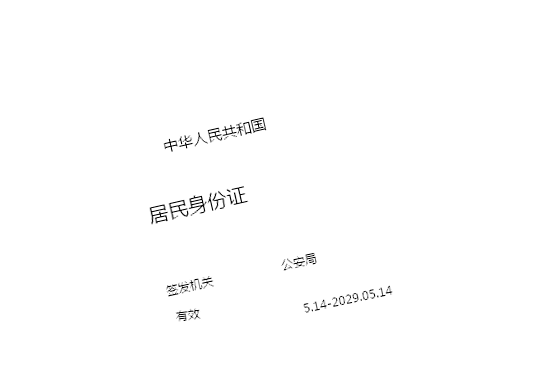
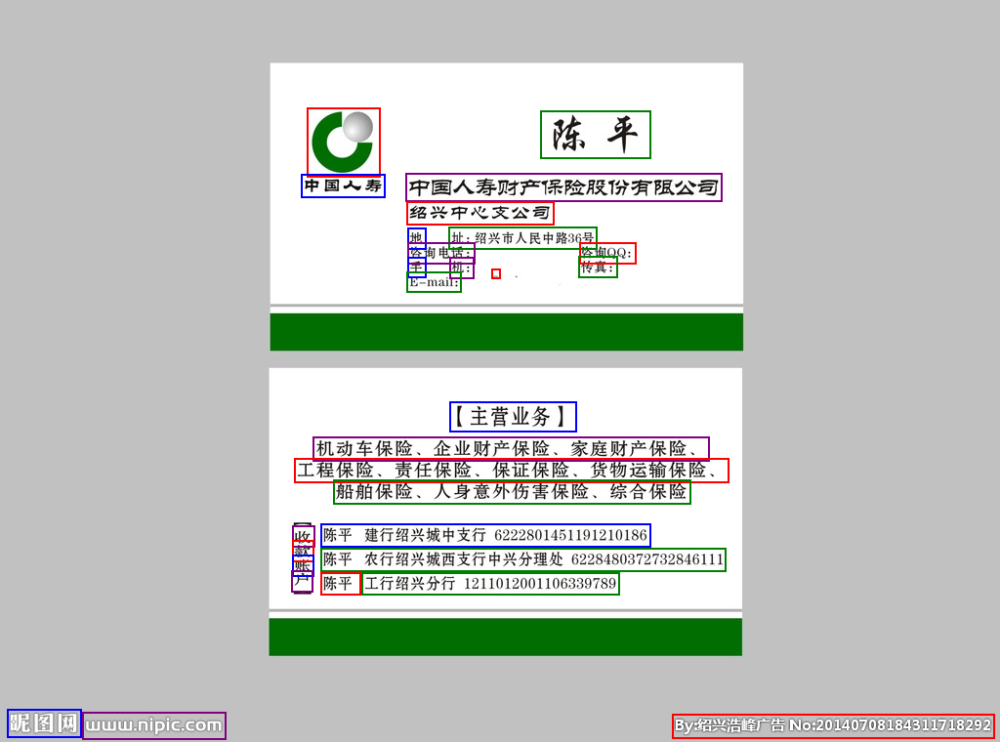
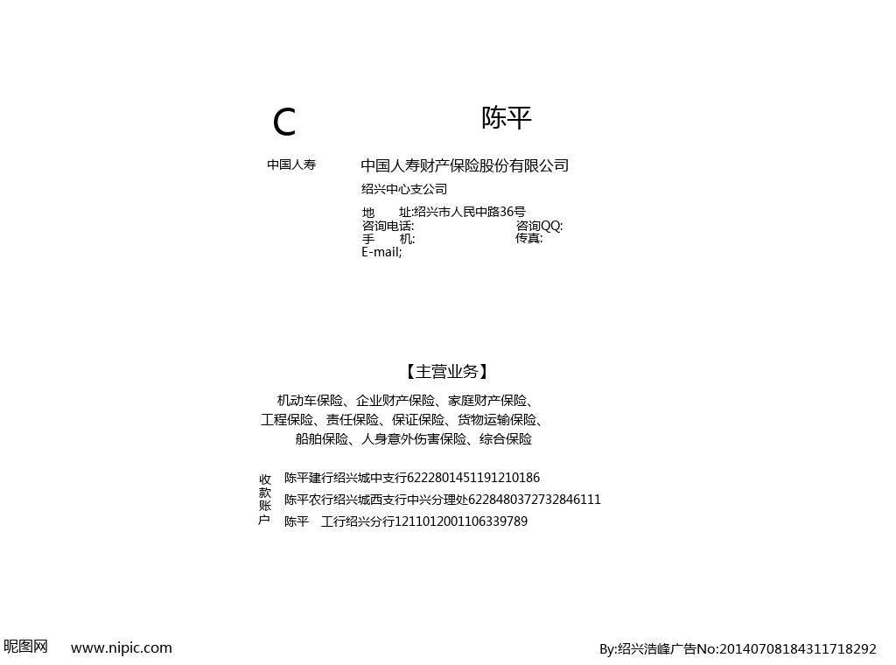

# tr - Text Recognition 
Tested under Python3 with *Ubuntu 16.04* and *Ubuntu 18.04*

一款针对扫描文档的离线文本识别SDK，核心代码全部采用C++开发，并提供Python接口

#### 说明
经过半年时间的测试与bug修复，目前本软件运行稳定，可放心在实际项目中使用 
授权协议：<a href="http://www.apache.org/licenses/LICENSE-2.0.html">Apache License, Version 2.0</a>
  
如果喜欢本软件，打开支付宝扫一扫，您的赞助是我们开发的最大动力 

#### TODO
- [ ] Use ONNX Runtime instead of libtorch

<!--
#### TODO
- [x] 检测带角度的文本框
- [x] 识别部分支持带角度的文本框
- [ ] 优化识别部分代码
- [ ] 支持表格检测
- [ ] 识别英文空格
- [ ] 支持GPU/手机端
-->

#### Requirements
<pre>pip install numpy Pillow opencv-python
</pre>
#### Install
+ 安装方法一
<pre>git clone https://github.com/myhub/tr.git
cd ./tr
sudo python setup.py install
</pre>
+ 安装方法二
<pre>pip install git+https://github.com/myhub/tr.git@master
</pre>
+ 测试是否安装成功
<pre>python test.py
python test_angle.py
</pre>

#### 关联项目
+ 若需要Web端调用，推荐参考<a href="https://github.com/alisen39/TrWebOCR">TrWebOCR</a>

#### How To Use?
<pre>import tr

# detect text lines, return list of (x, y, width, height)
print(tr.detect("imgs/web.png"))

# detect text lines with angle, return list of (cx, cy, width, height, angle)
print(tr.detect("imgs/id_card.jpeg", tr.FLAG_ROTATED_RECT))

# recognize text line, return (text, confidence)
print(tr.recognize("imgs/line.png"))

# detect and recognize text lines, return list of ((x, y, width, height), text, confidence)
print(tr.run("imgs/name_card.jpg"))

# detect and recognize text lines with angle, return list of ((cx, cy, width, height, angle), text, confidence)
print(tr.run_angle("imgs/id_card.jpeg"))
</pre>

#### 效果展示

